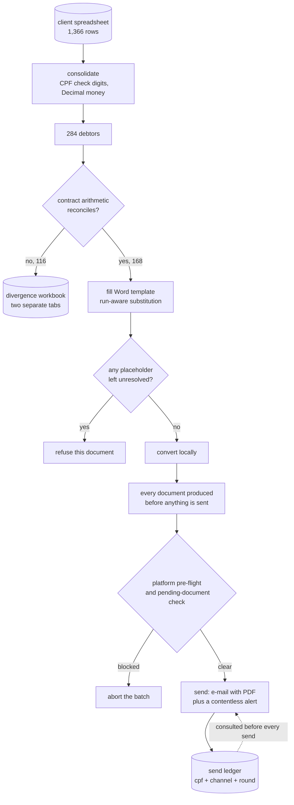

# A bulk legal-notice pipeline that refused to send 116 of 284 letters

**Client:** a private education company, through the law firm acting as its representative
**Role:** sole engineer · **Status:** built, reviewed, and deliberately not fired
**Headline numbers:** 284 debtors · 168 documents generated · 116 blocked · 0 notices sent

A collection campaign where the interesting output is the refusals.

## The problem

A private education company had 284 former students in default on tuition and mentoring
contracts — 1,366 overdue instalments, around R$ 2.74 million once updated. Before any of it
could become a lawsuit, each debtor had to be served an *extrajudicial notice*: a letter,
signed by the responsible lawyer, granting seven working days from receipt to pay or propose
a settlement. That act is what puts a debtor formally in default, and it is a prerequisite for
everything that follows.

Two hundred and eighty-four of those letters is not a drafting problem, it is a correctness
problem. Each one restates the debtor's contract in a sentence of the form *"total price of X,
payable in N instalments of Y"*, under a lawyer's signature. If those three numbers do not
reconcile, the firm has signed a document containing a false statement about its own client's
contract — and has handed opposing counsel the first thing they would look for.

The second problem is that a duplicate is not a duplicate. Sending the same notice twice does
not produce one extra e-mail; it produces **two seven-working-day deadlines running in
parallel**, evidenced by two documents signed by the same lawyer and contradicting each other
about when the clock started.

## What it does

- Reads the client's spreadsheet, validates each CPF's check digits, and consolidates 1,366
  instalment rows into 284 debtors.
- Reconstructs each debtor's contract arithmetic and **refuses to generate a document whose
  stated figures do not reconcile**, routing the exceptions into a spreadsheet the client can
  answer instead of forcing them through.
- Fills a Word template without destroying its formatting, converts to PDF locally, and fails
  loudly rather than emitting a letter with an unresolved placeholder in it.
- Sends each notice by individual e-mail with the PDF attached, and records the send in a
  ledger keyed so that no debtor can be served twice for the same round.
- Sends a separate, deliberately contentless message over a second channel as a heads-up,
  carrying no amount and none of the vocabulary of debt.
- Checks the messaging platform's own health before a batch, and stops before it starts if
  the account would refuse the traffic.

## Architecture

One command-line entry point with seven subcommands, ordered so that each stage can be
verified on its own before the next one runs: check the data, request the missing contract
figures, generate, diagnose the platform, queue, send, audit. Only one of the seven touches
the outside world, and it takes two independent affirmations to do so.

The deliberate split inside that last stage is between *generate everything* and *then send*.
If the two hundredth document fails, the right time to find out is with zero notices in the
wild rather than a hundred and ninety-nine.

## Design decisions

**Refuse to sign a sentence that does not add up.** The template asserts a total, an
instalment count and an instalment value. Where those do not reconcile, generation raises
rather than rounding or picking a plausible figure. This single rule is what blocked 116 of
the 284: seventy-five where the figures diverged, forty-one with no contract data at all.
That is not a failure rate, it is the system working — every one of those 116 is a question
the client has to answer, and the alternative was 116 signed documents containing a false
statement.

Two measurements justified the rule rather than intuition. Using the spreadsheet's raw
instalment column — the *overdue* instalment, not the contractual one — would have produced a
false sentence for 94 of the 243 debtors who had data at all. And neither reconstruction
hypothesis worked on its own: deriving the instalment as total ÷ count was correct for 140 of
243, and subtracting the entry payment was correct for 27 of 92.

**Two contract regimes, two templates, and the derivation inverted between them.** Contracts
without an entry payment state "total X in N instalments of Y", so Y is derived as X ÷ N and
the sentence is true by construction. Contracts with an entry payment state "total X, of
which E as entry and N instalments of Y", so E + N × Y must equal X — and there Y has to come
from the spreadsheet, because that is the figure that reconstructs the total. Deriving it
would break precisely the cases whose data was intact.

The second template is generated by a script that performs one literal, formatting-preserving
substitution and fails if it does not find exactly one matching paragraph. It emits a `.docx`
specifically so the responsible lawyer reviews the new wording as prose, rather than reading
Python.

**Idempotency belongs in a database, not in a loop.** The send ledger has a unique key on
*(debtor, channel, round)*. A failed attempt does not occupy the key, so retries work; a
later failure can never overwrite a recorded success, so reprocessing cannot un-send. Channel
and round are independent axes, because a new round genuinely is a new collection act and
should go out again.

An in-memory check would have covered the ordinary case and failed exactly where it mattered:
a crash halfway through a batch.

**The rate limit is also read from the ledger.** The messaging platform counts unique
recipients over a rolling twenty-four hours, so the system counts the same way, seeding its
counter from the database before the loop rather than from the process. Running the command
twice in one day therefore cannot send twice the cap.

**Deferred is not failed, and is not recorded.** When the cap is reached, the remaining
debtors are counted as deferred and **nothing is written to the ledger** — writing them would
mark them as handled, and they would never go out the next day. The run prints the instruction
to repeat the same command tomorrow.

**Two independent affirmations before anything real.** Dry run is the default and only the
literal string `false` disables it; on top of that, an explicit flag is required on the
command. A batch size cap means the first live run is five letters, checked by eye in the sent
folder. And the send aborts entirely if any debtor failed document generation, unless that is
overridden deliberately.

**Check the platform before the batch, not during it.** A pre-flight query asks the messaging
provider whether the account can send at all, and aborts on a payment block, an unapproved
display name, or a configured daily limit above the real one. Without it, 284 attempts would
go out and be refused one at a time — delivering nothing while marking the number with a whole
batch of failures.

Two traps were paid for in that diagnostic. The provider returns both a current messaging
limit and a deprecated field that reports a lower, stale tier in the same payload, so the code
reads the correct one. And two protocol error codes that appear constantly and mean nothing
are filtered out of the blocker list, on the grounds that a blocker list with noise in it
trains the operator not to read it.

**Word fragments placeholders across runs, and the naive fix destroys the document.** In this
client's template a single placeholder spans three runs and another spans four, because Word
splits text wherever formatting or a spell-check mark changes. Assigning to the paragraph's
text would substitute correctly and flatten every bold, font and spacing change in the
document. The substitution therefore builds a position-to-run map, applies matches
right-to-left so earlier offsets stay valid, writes into the run where each match begins, and
recomputes the map after every edit. A test asserts that bold survives.

**Conversion stays on the machine.** The PDF is produced through the locally installed Word
rather than LibreOffice or any cloud converter, because the file carries a name, a CPF and an
amount. Where Word is unavailable the system attaches the `.docx` and warns once, degrading
rather than halting — though sending an editable document as a collection instrument is
itself treated as a last resort, being an invitation to argue about what it said.

## The legal rules that live in code

Article 42 of the Brazilian consumer code forbids exposing a debtor to embarrassment in
collection. The second channel surfaces on a lock screen, read at a desk with other people
nearby, so the message sent there carries **no amount and none of the vocabulary of debt** —
it is a neutral notice that a communication exists, and the substance travels by individual
e-mail.

That rule is not a comment. A test renders the message and asserts it contains neither the
figure nor any of the words for *debt*, *default*, *debtor* or *arrears*. It is the only
forbidden-wording test in the suite, and it is there because this is the rule whose breach
would be a legal problem rather than a bug.

The e-mail is the legally operative act, because its delivery is provable, so the send keeps a
copy in the sent folder as evidence. The body deliberately does not restate the debt: two
versions of the same text, in the letter and in the covering e-mail, is the second thing
opposing counsel would look for. Payment, proof of payment and negotiation are all routed to
the client's own receivables channel rather than the firm's, which keeps the firm out of a
conversation it should not be in.

The amount appears as a figure and in full written form, following the drafting convention,
so a transposed digit cannot pass unnoticed by either party.

## Scale and state

| | |
| --- | --- |
| Debtors consolidated | 284, from 1,366 instalment rows |
| Documents generated | 168 |
| Blocked by the arithmetic gate | 75 |
| Blocked by missing contract data | 41 |
| Notices sent | 0 |
| Tests | 64 cases, 93 assertions, none touching the network |
| Lines | about 3,700 |

The three largest blocks of the test suite are organised around consequences rather than
modules: do not notify twice, do not exceed the platform cap, do not put a false number in a
signed document. The first of those includes an integration test that runs the whole
generate-and-send cycle twice against a counting fake and asserts the mailer was called once —
because a regression in that wiring would surface nowhere else, and would be discovered by a
debtor receiving two deadlines.

A smaller one is worth recording as a failure. The first version of the "generate a sample for
human review" command took the first few debtors, and returned six documents totalling about
eleven thousand reais out of a universe spanning roughly one thousand to thirty thousand. The
reviewer never saw an expensive case. The replacement slices the value range into bands and
prefers unseen combinations of product and payment profile.

**Nothing has been sent.** The ledger database does not exist on disk, which is first-hand
confirmation rather than a claim. The project is frozen on a decision that is not technical:
the messaging number is shared with another system whose business-account verification depends
on that number's conduct, and 284 collection messages are the textbook pattern for mass
reports. Three options are documented and the decision belongs to the responsible lawyer.

## Data and privacy

The system processes the personal data of 284 identified individuals — names, CPF numbers,
contact details and debt amounts. The lawful basis is the performance of a contract together
with the regular exercise of a right in credit recovery; the contact details were inherited
from the contractual registration, which is a compatible purpose.

Three consequences are visible in the design. PDF conversion is local, so files carrying a
name, a CPF and an amount never leave the machine. The ledger stores the amount communicated
per send, specifically so the firm can answer a data subject asking what was said to them,
when, and through which channel. And the data directories are excluded from version control.

One detail is worth naming because it is the kind that gets missed: **the generated filenames
encode the CPF and the name**, so even a directory listing is a disclosure. That, more than
anything in the source, is why no part of this system could be published with its working
directories intact.

## How AI was used

No language model is involved at runtime. The pipeline is spreadsheet to dataclasses to
decimal arithmetic to template substitution to two APIs — entirely deterministic, and
deliberately so, because every output is a signed legal instrument.

An AI coding assistant was used to build it, and the artefact worth mentioning is the
instruction file written for that assistant. It lists the invariants the assistant may not
relax: the dry run stays the default, no document is generated without contract data, the
idempotency ledger is never bypassed "to resend quickly", and no send happens without the
responsible lawyer's recorded approval.

Putting the irreversibility guards into the agent's context, and not only into the code, was a
deliberate choice. The code can be edited by the next person; the instruction file is what an
assistant reads before proposing that edit.

## What I would do differently

**Version control from the first commit.** This project is not in git, and its `.gitignore`
was written for a repository that was never initialised. That is the clearest mistake here:
there is no history for a system whose correctness argument depends on when each rule was
added and why.

**Finish the conversion step before counting the generation as done.** The 168 documents exist
as `.docx` and there is not a single PDF on disk. The thing the e-mail is supposed to attach
has not been produced, and "168 generated" quietly overstates how close to sending this is.

**Decide the shared-number question before building the channel.** Several days of work went
into a messaging integration that is blocked on an account-level matter and a reputational
decision that should have been settled first. The diagnostic that discovered it is good work;
it is also work that would not have been needed in the other order.

**Separate the two divergence groups earlier.** Seventy-five "check this figure" and
forty-one "fill this blank" are different requests to the client, and merging them would have
arrived as "review 116", which is easier to postpone than either half. That split was made
eventually; it should have shaped the first message to the client rather than the third.

**Subscribe to inbound before sending outbound.** With no webhook, a reply saying "I already
paid" or carrying proof of payment would be lost entirely. Sending a collection notice down a
channel you are not listening to is the wrong shape, and that was noticed late.

## Why this is a case study and not a repository

Three reasons, in descending order of how much they matter.

The data cannot be separated from the system. The working directories hold the records of 284
identified individuals, and the generated filenames encode their CPF numbers, so even the file
listing is disclosure. A public version would need all of that replaced, and what remains is
the smaller half.

The legal instruments are not mine. The Word templates carry the client's and the firm's
signed wording, which is their drafting, not my code.

And the most interesting thing here does not need the code to be understood. This is a system
whose headline result is that it declined to produce 116 of 284 documents, and every refusal
is traceable to a named rule with a reason recorded next to it. That argument fits in a page.

Several components are generic enough to be published on their own against synthetic data, and
are the likeliest follow-ups: the idempotent send ledger, which is about a hundred and fifty
lines and generalises to any outbound-communication automation; the formatting-preserving Word
placeholder engine, which solves a problem anyone filling templates will hit; and the
name-normalised spreadsheet reader that fails loudly when a column moves instead of silently
reading the wrong one.
