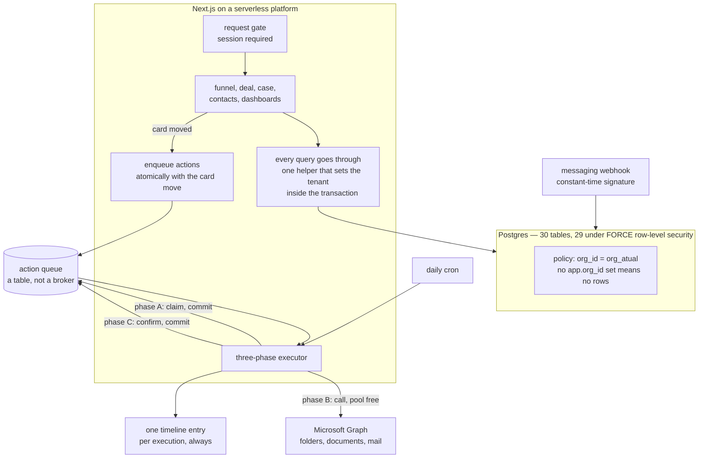

# A bespoke CRM built as a multi-tenant product with one tenant

**Client:** a Brazilian business-law firm of about forty lawyers · **Role:** sole engineer
**Status:** in production on an assisted pilot, with the automation engine in dry run
**Headline:** 45,000 lines · 30 tables, 29 under forced row-level security · 8 P0 findings from an adversarial review of my own work, all closed

The interesting parts are a tenancy model enforced by the database rather than by the
application, and an action engine that documents its own new failure mode.

## The problem

A forty-lawyer firm was about to buy a commercial CRM. Two were on the table, and neither fit
the thing the firm actually needed, which was not a sales pipeline but *its own commercial
process* — a documented sequence from first contact through proposal, contract and client
onboarding, with mandatory copies on certain e-mails, a specific folder structure, and a
specific set of steps that someone performs by hand and occasionally forgets.

Three problems, layered over about four months.

**Deals were invisible outside e-mail.** The governing sentence in the project's own README is
that a demand which is not in the funnel does not exist. Before this, a demand lived in
whichever lawyer's inbox received it.

**The mechanical steps were done by hand.** Create the client folder. Send the proposal with
the right people copied. Route the contract to the signature platform. Open a group with the
client. Each of those is a place where something gets missed, and none of them is a decision —
they are consequences of a decision somebody already made by moving a card.

**And then a practice area appeared with no system at all.** A restructuring and
judicial-recovery practice was being run off a single-file HTML prototype that kept everything
in the browser's local storage and protected editing with a four-digit PIN held in plain text
in the page.

## What it does

- Models the firm's commercial process **as data** — pipelines, stages, each stage's service
  level, its required fields, and the list of actions that firing it should cause — so changing
  the process is a configuration change rather than a deployment.
- Runs those actions through a queue that survives deploys, retries transient failures three
  times, recovers from crashes, and reports what it could not do to a screen with a reprocess
  button.
- Creates the client's document folder, uploads documents, and will send the proposal and route
  the contract once the remaining authorisations land.
- Runs the restructuring practice: thirteen statutory phases, deadlines read from law, the
  documentary checklist the statute requires, a generated schedule of tasks relative to the
  filing date, and automatic alerts.
- Summarises a negotiation and drafts a message with a language model, as a **draft** — the
  system sends nothing — with per-organisation cost accounting on every call and a daily cap
  per user.
- Isolates every tenant's data at the database level, so that a bug in the application cannot
  return another tenant's rows.

## Architecture

Two runtimes over one database: the web application, and a set of command-line tools and one
serverless webhook in Python. No ORM — hand-written SQL, twelve numbered migrations, and a
schema file kept as the mirror of current state. Seven runtime dependencies in the web app.

## Design decisions

### Tenancy is enforced by the database, and the default is to return nothing

Every data table carries an organisation column, and twenty-nine of the thirty tables have a
row-level security policy created in a loop over a literal list of table names. Two details
make it hold.

The policy compares against a function that reads a session setting **with the
missing-is-null flag**, so an unset tenant yields null, and null matches no row. The default
is therefore to deny rather than to leak: forgetting to set the tenant returns zero rows, not
every row. And the policies are `FORCE`d, which means even the table owner obeys them — the
application's own role cannot opt out.

The context is set inside the transaction, not on the session, which matters for two separate
reasons. With a connection pool, a session-scoped setting would survive into whichever request
reused that connection next, which is a cross-tenant leak with no error attached to it. And
transaction scope is what makes the design compatible with a pooler running in transaction
mode, which is how the hosted database is reached.

Every read and every write goes through a single helper that opens the transaction, sets the
tenant **as a parameter rather than interpolated into SQL**, and runs the query. Outside that
helper, row-level security returns nothing, by design.

There are two database roles: an unprivileged one the application connects with, and an owner
used for migrations and never deployed. Forced policies only protect anything if the
application is not the owner.

**And the isolation was proven rather than asserted.** Two SQL scripts run as the unprivileged
role — a superuser bypasses the policies and would prove nothing — and check four guarantees:
without a tenant set, zero rows; tenant A sees nothing of tenant B; the reverse; and a
cross-tenant write is refused by the policy's check clause.

One honest limitation: the tenant identifier is still an environment variable rather than
derived from the session, because there is one tenant in production. The mechanism is
per-request capable; the resolution step is the piece that is missing.

### The action queue is a table

Not a message broker. The reasoning, written into the migration that created it: the state
survives a deploy or a restart, it is auditable — who, what, when, and why it failed — it obeys
the same tenancy rules as every other row, and it needs no new infrastructure.

**Enqueueing is atomic with the card movement; executing is not, deliberately.** Moving a card
writes the deal update, the movement row, and the queued actions in one transaction: either the
card moves and the actions are queued, or nothing happens. But a failure to *execute* an action
never rolls back the movement, because the lawyer's drag of a card is a fact about the business
and a throttled API call is not.

### The three-phase executor, and what the refactor cost

The first version ran one action per transaction. That meant an HTTP call to an external API
held a pooled connection and a row lock for its entire duration, including rate-limit waits. A
throttling incident at the provider therefore became an incident in the whole CRM: people
simply browsing the funnel were timing out waiting for a connection.

The rewrite splits each action into three short transactions. **Phase A** claims one row with
`FOR UPDATE SKIP LOCKED`, marks it executing, increments the attempt counter, and commits — the
lock dies there. **Phase B** runs the external call with the pool free. **Phase C** re-confirms
the claim and records the outcome in a new transaction.

The part worth copying is not the pattern, it is that the code writes down what the pattern
*cost*. In the old design, a crash mid-action rolled back and the row returned to pending by
itself. Now phase A has committed, so a crash between A and C leaves the row genuinely stuck in
executing — and the ten-minute orphan window, which used to be a theoretical seatbelt, becomes
the real recovery mechanism. Which is why, the comment continues, the handlers must be
idempotent; and then it enumerates, handler by handler, how each one is.

Three numbers in that engine each carry their reason. The retry ceiling is three, because a
transient failure resolves on the second or third attempt and anything surviving three spaced
attempts is persistent — an expired secret, a missing permission, a bug — which needs to become
a signal to a human rather than an infinite loop burning API quota and filling a client-visible
timeline. The orphan window is ten minutes because that exceeds any function duration the
platform allows, so beyond it nobody can still be executing. And the attempt counter doubles as
the claim's serial number, so a stale outcome from a slow turn cannot overwrite a newer one.

**A second-order bug, found by reviewing the first fix.** The orphan clause did not filter on
the attempt count. Harmless in the old design — but once orphan recovery became the real
resumption path, a row that had already failed three times would be picked up again every ten
minutes forever, defeating the very ceiling it was meant to respect. And simply skipping it was
not enough: a row stuck in executing is invisible to the health screen, which looks for
failures. So the exhausted orphan is given the outcome it deserves and becomes somebody's
problem.

### Dry run is the default, in both languages, and only one literal switches it off

In the Python tools and in the web application, the automation runs in simulation unless an
environment variable holds the exact string `false`. A missing variable, an empty one, or a
typo keeps the safe mode. A simulated action gets its own terminal status, so the audit trail
records that it *would* have run.

The distinction is semantic rather than blanket: internal actions — create a task, start the
onboarding sequence — execute for real even in dry run, because they are reversible and have no
effect outside the database. What is simulated is what reaches somebody else.

A sibling state exists for actions that are in the configured vocabulary but have no handler
yet. Seven of the eleven are in it today. They are not errors; they sit outside the hot index
with a discreet timeline entry, so nobody is left wondering.

### Only the official channel, decided before any code

The common way to automate a messaging channel is a library that drives the consumer
application through a scanned QR code. The project refused it, and the README says why: the
platform now detects that kind of connection by fingerprint, with a permanent ban and no
appeal. The number that creates the group is the number the client sees as being the firm. That
is not an asset to gamble to save a click.

The cost of the decision is real and was accepted: the official API requires a verified
business badge, which requires thirty days of registration plus verification plus an approved
display name. The phone line was therefore requisitioned **before any code was written**,
because the clock only starts when the line is active.

Meanwhile the pipeline degrades on purpose. Group creation sits behind an interface, and until
the badge arrives a human is handed the image, the notice text and the link in a card — sixty
seconds of manual work. When the badge lands, the adapter is swapped and nothing else is
rewritten.

### Logging is an allowlist, not a redaction filter

The logging module opens with a rule to read before adding any field: the log records
**identifiers, never content**. A law firm cannot have a client's name, a fee amount, or an
individual's e-mail address landing in a third-party log aggregator that indexes and retains
everything written to standard output.

So error objects are never serialised whole, and the error *message* is never logged — because a
unique-constraint violation's detail contains the colliding values literally, which is to say a
real e-mail address, and a failed folder call returns a path containing the client's name. What
is emitted instead is an allowlisted technical sheet: error class, database error code, the
constraint that was violated, the table, the HTTP status. The full text still exists, in a
column, behind the tenancy policy and behind authentication.

### Errors have two audiences, and the code enforces the split

Every failure is turned into two texts. The technical one goes to the database and to the
expandable detail on the health screen. The plain-language one goes to the deal's timeline,
which is read by a lawyer and sometimes by the client.

The timeline is filtered further: only *terminal* failures appear there at all. A failure the
engine is still going to retry by itself is not a fact about the case, it is infrastructure
noise, and the deal record receives facts.

### Two independently correct decisions that composed into a bug

Folder names are a pure function of the client's name, which is what makes folder creation
idempotent. Creating a folder uses the provider's fail-on-conflict mode and then catches the
conflict to reuse the existing folder, so re-running provisioning cannot scatter "Client 1" and
"Client 2" directories. Both of those are right.

Together, with a company table that had no uniqueness constraint at all, they meant that two
separately created records for the same client would not produce two folders. They would write
two different clients' contracts and corporate documents **into the same directory** — and two
lawyers registering the same client on the same day was all it took.

The fix is layered: a unique index on the lowercased name as the database's net, a friendly
check in the application so the user sees a sentence rather than a constraint violation, and an
explicit note that parent-and-subsidiary records remain possible, because the index blocks
identical names rather than similar ones — and it is precisely that difference in name that
gives them distinct folders.

### Access control in four layers, and a comment about blame

A domain allowlist runs *before* the database, so an external guest in the identity tenant
never even gets a user row. A stateless session token is revalidated against the database every
five minutes, so deactivating someone takes effect within five minutes rather than at their
next login. The request gate returns `401` JSON to API routes rather than redirecting, because a
programmatic client following the redirect would receive the login page with a success status
and conclude the call had worked. And then the database.

The best comment in that area is about diagnosis rather than security. The sign-in handler had
been catching every exception and turning it into access-denied — so a sleeping database told a
lawyer that their account was not authorised, and sent the entire investigation in the wrong
direction. The fix separates a legitimate refusal from an unavailability, and required a custom
error subclass, because the framework wraps ordinary exceptions back into access-denied and
would have reinstated exactly the accusation the fix existed to remove.

### The language-model module accounts for itself from the first call

Two features ship: summarise a negotiation, and draft a message. The system sends nothing — a
draft is a draft.

No SDK: the call is a direct request with four headers, because the dependency would not pay
for its own weight and the interface stays swappable. The fetch implementation is injected, so
tests exercise the whole path with no key and no network. The feature is flagged by the
*absence* of configuration — no key means no AI interface renders and the server actions refuse.

The module's rule is in capitals: every call must write a usage row in the same calling
function, because the per-organisation cost exists from day one and is never optional. A daily
cap per user is counted against the São Paulo civil day rather than UTC, so the day does not
turn over at ten in the evening local time.

One production bug is documented where it happened. The code asked for a model alias and the
API answered with the dated concrete version, so an exact-match price lookup found nothing and
**every real call recorded a null cost** — emptying the very report the accounting existed to
produce. The fix matches by prefix with the longest alias winning, and the reason for that
tie-break is written down.

The prompt guardrails come from professional conduct rules rather than from prompt engineering:
a closed three-value vocabulary of message types instead of free text, any fact not present in
the supplied context must come back marked for confirmation, and no promise of outcome — next
steps and measures, never success, never an amount won, never a date for a judicial decision.
The model only ever sees what a tenant-scoped query already returned.

## Scale and state

| | |
| --- | --- |
| Total tracked | about 45,000 lines across 298 files |
| Web application | 31,660 lines of TypeScript and TSX |
| SQL | 4,199 lines: schema, 12 migrations, 3 seeds, 2 isolation tests |
| Python | about 3,230 lines across five tools and one webhook |
| Documentation and research | 5,871 lines |
| Tables | 30, of which 29 under forced row-level security |
| Actions in the vocabulary | 11, with 4 handlers implemented |
| Python tests | 49, none touching the network |
| TypeScript tests | none |
| Running cost | about US$ 39 a month on the pilot |

**Verification here is adversarial review plus database invariants, not unit tests.** I wrote a
pre-pilot review of my own work that produced eight critical, twenty high and twenty-two medium
findings, each reproduced in a local database rather than asserted, with the commits that closed
them naming the finding identifiers. The review also keeps an appendix of findings that were
investigated and **disproved**, so they are not rediscovered later — including one
rate-limiting concern that turned out not to exist.

Two measurements from that review are worth repeating because they show the shape of the
mistakes. The home page was loading every pending task in order to display eight of them: at
twenty thousand tasks that is 4.5 megabytes and 165 milliseconds on every page load. And the
document listing on a deal record was adding three hundred to eight hundred milliseconds to
every render of that page before it was moved behind a streaming boundary.

State machines live in check constraints rather than in application promises — a deal cannot be
open and carry a closing date, cannot be lost without a reason, and cannot point at a stage
belonging to a different pipeline. One index carries a trailing identifier specifically so that
cursor pagination becomes a range scan and two events in the same instant are never skipped or
repeated across pages.

Several smaller decisions each have a reason recorded next to them: a one-constant module exists
purely so that importing a retry ceiling does not drag four integration modules into the bundle
of a page that only runs a count; the login page uses a transparent one-pixel source so a
149-kilobyte brand panel is never downloaded on a phone, which `display: none` would not have
prevented; stage probabilities default to null and the forecast says "not configured" rather
than showing an invented projection, because a probability is a business number and belongs to
the firm's own history rather than to a seed file.

Everything is named in Portuguese — tables, columns, functions, variables — because that is the
language of the domain and of the firm's own documents. The handful of English terms that remain
are the ones the firm itself uses.

## Data and privacy

In production the system holds the firm's commercial data and, through the restructuring module,
client matter data: company records, contacts, deal values, case phases and documents. Three
parts of the design exist because of that.

Tenant isolation is at the database level, so an application bug returns zero rows rather than
somebody else's. Logging records identifiers and never content, for the specific reason that the
platform's log aggregator indexes and retains whatever a function writes. And the document
folders live in the firm's own tenant rather than in this system — the CRM creates a folder and
holds a reference, and the documents themselves never pass through it.

Sharing links are refused by policy in code: an anonymous link to a case folder with neither a
password nor an expiry raises rather than being created, because an eternal anonymous link to a
matter folder is a leak waiting to happen. Group joins require approval by default, which makes
professional confidentiality an architectural control rather than a rule someone has to remember.

## How AI was used

Two language-model features are *in* the product, described above. This section is about
building it.

An AI coding assistant was used throughout, and the division of labour was consistent: it
produced first drafts of screens, forms and the repetitive query layer, and I wrote or rewrote
every piece of logic where being wrong has a consequence — the tenancy helper, the executor's
phase boundaries, the retry eligibility clause, the logging allowlist, and the check constraints.

The most useful thing it did was not generation. The pre-pilot review that found eight critical
issues was a deliberate adversarial pass over my own finished work, and the findings were then
reproduced in a local database before being accepted. Several of the best decisions in this
system — the three-phase executor, the domain allowlist, the five-minute revocation, the
blame-attribution fix — exist because that review found them, not because I designed them
correctly the first time.

What I threw away, as a representative example: a first version of the orphan-recovery clause
that looked correct and would have re-run a permanently failed action every ten minutes forever.
It was caught by asking what the previous fix had changed about the system's assumptions, which
is a question worth asking after every fix.

## What I would do differently

**Write the TypeScript tests.** There are none, and this is the single largest gap between the
quality of the reasoning in this codebase and the quality of its safety net. Several modules are
deliberately written to be testable outside the framework with a fake client, and the AI
provider takes an injectable fetch for exactly that purpose — the seams are there and the tests
were never written. The Python side has forty-nine and the database has its isolation proof;
the thirty-one thousand lines in the middle have an adversarial review and nothing automated.

**Derive the tenant from the session, not the environment.** The isolation is proven and the
mechanism is per-request capable, but as deployed there is one organisation in an environment
variable. That is the difference between a multi-tenant design and a multi-tenant system, and
it should be closed while there is still only one tenant to migrate.

**Do not share one application registration across six consumers.** Reusing the existing
identity was the right instinct and the wrong conclusion: one client secret now serves six
things, so a partial rotation breaks modules silently. That finding is what produced the health
endpoint — which is a good outcome from a bad decision, but the decision was still bad.

**Put the content-security headers in before the pilot, not after.** They are still on the
medium-priority list, which is the wrong list for a header.

**Rotate everything that has sat on disk.** Two environment files hold a filled-in set of real
credentials — API keys, a database owner connection string, an application secret. They are
correctly excluded from version control and were never committed, but they have existed next to
a working tree for months, and "never committed" is not the same as "never exposed".

## Why this is a case study and not a repository

The code belongs to the firm, and that would be reason enough. But two other things make a
sanitised copy the wrong artefact.

The configuration *is* the confidential part. This system's distinguishing idea is that the
firm's commercial process is modelled as data — so the seed files encode a real firm's
operating procedure: its stage names, its service levels, its rules about who must be copied on
what, its reasons for losing work, and the proprietary workflow of its restructuring practice.
Replacing all of that with fiction is possible, and what remains is a generic CRM schema that
demonstrates nothing about the thing that was actually interesting.

And the documentation carries more identifiers than the code does. The runbook for obtaining the
messaging badge is a genuinely useful 726-line account of a process that is barely documented
anywhere — and it is a status table of real account identifiers, a real phone number, and the
names of two real people. The deployment runbook names a colleague and a hostname. The
competitive analysis quotes two real individuals' e-mail addresses as evidence of what a
prospecting-data vendor sells. None of that is in the source; all of it is in the parts worth
reading.

The reusable piece was extracted instead. The messaging client — the limits checked before the
call, the idempotent group creation, the webhook signature verification — is published on its
own as [whatsapp-cloud-api-client](https://github.com/fillipeml/whatsapp-cloud-api-client),
rewritten against fictional data with 151 tests, and with two request-shape bugs fixed that the
original still has.

The tenancy model has been extracted too, and it is the part of this system I would most want
someone to copy:
[postgres-rls-multitenant-starter](https://github.com/fillipeml/postgres-rls-multitenant-starter)
carries the policy loop, the deny-by-default tenant function, the transaction-scoped setting
that makes connection pooling safe, the two-role split, and the four-guarantee isolation test
run as an unprivileged role — against three invented tables instead of twenty-nine real ones.

It also does something this system does not. Each of the four ways to get this wrong is
*reproduced* by a script that asserts the hole exists, rather than described in a comment. That
turned out to matter: one of the five I set out to demonstrate was not a hole at all, the
assertion failed in CI, and the claim was corrected before anybody read it.
